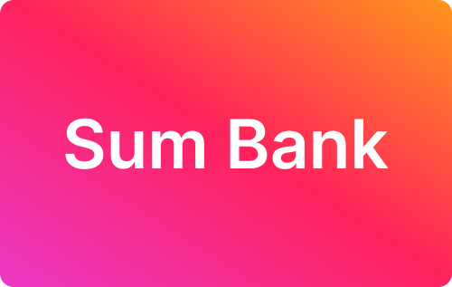

# Sum Bank



A minimal, end-to-end demo of a modern digital banking platform inspired by various neo banks.  
Sum Bank demonstrates clean frontend design, API-first backend principles, and AWS-native observability.

---

## Overview

Sum Bank simulates two key views of a banking product:

- **Customer app (React + TypeScript)**  
  Users can sign in, view their balance, make transfers, and see their transaction history.

- **Admin console (React + JSON data)**  
  Displays operational metrics — API latency, DynamoDB usage, Lambda health, SLOs, ledger consistency, and incidents — mirroring a real internal operations dashboard.

The goal is not a full product, but a **portfolio-grade demonstration** of:

- TypeScript and React component architecture
- Event-driven AWS backend design
- System observability and reliability thinking
- Developer experience and maintainability

---

## Frontend

### Tech Stack

- [Vite](https://vitejs.dev/) for fast development
- [React 18](https://react.dev/) + [TypeScript](https://www.typescriptlang.org/)
- [Tailwind CSS](https://tailwindcss.com/) for styling
- [React Router](https://reactrouter.com/) for navigation

### Structure

```
sum-bank/
  client/
    src/
      components/      # Header, Footer, etc.
      pages/           # Signin, Signup, Balance, Transfer, Profile, Admin
      data/            # seed.json (user), admin.json (ops metrics)
      store.ts         # simple state & mock API
```

### Features

- Mobile-first design
- Balance, transfer, and profile screens seeded from static JSON
- Validated transfer flow with integer-pence precision and confirmation step
- Accessible forms and semantic markup
- Admin dashboard showing realistic operational metrics and incidents

### Run Locally

```bash
cd client
npm install
npm run dev
```

### Build for Production

```bash
npm run build
npm run preview
```

---

## Backend

**Language:** Go (Golang)  
**Infrastructure as Code:** AWS CDK (TypeScript)

### Core AWS Services

| Layer          | AWS Service                   | Purpose                                                   |
| -------------- | ----------------------------- | --------------------------------------------------------- |
| API Layer      | **API Gateway + Lambda**      | REST endpoints for balances, transfers, and admin metrics |
| Data Store     | **DynamoDB**                  | Accounts, transfers, and projected ledger state           |
| Data Ingestion | **DynamoDB Streams + Lambda** | Projects transactions into balance tables                 |
| Object Store   | **S3**                        | Audit logs and metrics snapshots (used by `/admin`)       |
| Analytics      | **Athena**                    | Query historical transfer data                            |
| Messaging      | **EventBridge**               | Event fan-out for async processing                        |
| Infra Mgmt     | **AWS CDK**                   | Infrastructure-as-code deployment                         |

### Local Development

The backend runs as a collection of Go Lambda handlers, using AWS SDK v2.

```bash
cd backend
go run cmd/api/main.go
```

### CDK Deployment (example)

```bash
cd infra
npm install
cdk bootstrap
cdk deploy
```

### Environment Variables

| Variable          | Description                       |
| ----------------- | --------------------------------- |
| `ACCOUNTS_TABLE`  | DynamoDB table name for accounts  |
| `TRANSFERS_TABLE` | DynamoDB table name for transfers |
| `AUDIT_BUCKET`    | S3 bucket for audit data          |
| `REGION`          | AWS region (default `eu-west-2`)  |

---

## Data Flow

```mermaid
flowchart TD
  A[Frontend: React Client] -->|POST /transfer| B[API Gateway]
  B --> C[Lambda Handler (Go)]
  C --> D[DynamoDB Transfers Table]
  D -->|Stream Event| E[Balance Projector Lambda]
  E --> F[DynamoDB Balances Table]
  F --> G[API /balance Response]

  C --> H[EventBridge: Audit Event]
  H --> I[S3 Audit Log Bucket]
  I --> J[Admin Dashboard JSON Feed]
  J --> K[Admin Page: React Dashboard]
```

1. Frontend calls `/api/transfer` through API Gateway.
2. Lambda validates input, writes event to `Transfers` table.
3. DynamoDB Stream triggers a projector Lambda that updates `Balances`.
4. Balance data is read back through `/api/balance` or via Athena queries.
5. Metrics Lambda aggregates CloudWatch + DynamoDB stats and writes to S3 (`admin.json`).
6. The Admin page fetches that JSON and displays metrics and incidents.

---

## Observability

The `/admin` dashboard exposes realistic operational metrics for an event-driven AWS app:

- API latency (P95)
- Error rate (%)
- Lambda invocation rate
- DynamoDB RCU/WCU usage
- Projector lag (stream delay)
- Reconciliation mismatches
- Uptime, error budgets, burn rate
- Synthetic endpoint checks
- Incident log with MTTR/MTTD
- Audit trail of admin actions

These mirror what real fintech and banking teams track to maintain reliability and compliance.

---

## Example Admin Metrics

| Category             | Metric                          | Description                         |
| -------------------- | ------------------------------- | ----------------------------------- |
| **Core KPIs**        | Active users, API req/min       | Simulated CloudWatch data           |
| **Reliability**      | Uptime, error budget, burn rate | Reflects SLO tracking               |
| **Ledger**           | Consistency, recon mismatches   | Simulated reconciliation job output |
| **Synthetic Checks** | Regional health endpoints       | Multi-region simulated pings        |
| **Incidents**        | Severity, MTTR, MTTD            | Example operational logs            |
| **Audit Log**        | Admin actions                   | Configuration and access events     |

---

## Next Steps

Possible extensions:

- Hook `/admin` to a real Lambda that aggregates CloudWatch metrics daily
- Add Cognito authentication and session-based routing
- Replace static JSON with DynamoDB queries
- Add live data charts for latency, error rate, and transfer throughput
- Expand to multi-region deployment using Global Accelerator or Route53 health checks

---

## License

MIT © 2025 HTL  
For educational and portfolio demonstration purposes only.  
No real banking operations are performed.

---
